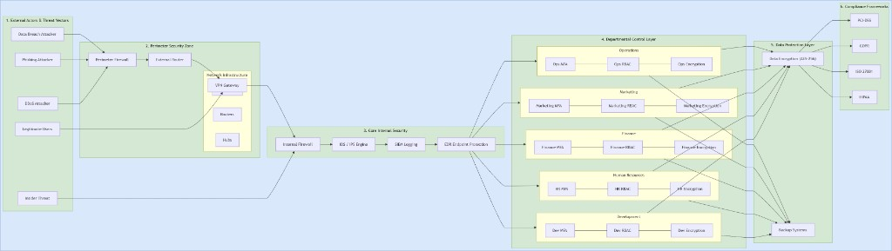

# Task 01: Security Architecture for a Large Organization

**Marks:** 16  
**Organization:** Cubix Code  
**Objective:** Create a security architecture for a big organization and discuss best practices for securing business-critical data.

---

## Security Architecture Flowchart

---

## Security Architecture Overview & Explanation

The security architecture for Cubix Code Organization uses a **Defense-in-Depth** strategy built on **Zero Trust** principles. Rather than relying on a single perimeter wall, the system isolates network assets into distinct security zones. This ensures every connection is verified, monitored, and restricted based on actual operational need.

### Zone 1: Threat Actors & Entry Vectors

This section defines the entry paths and entities attempting to interact with the organizational network:

- **External Attack Vectors:** Covers targeted threat types including DDoS attempts designed to disrupt availability, Phishing campaigns targeting credentials, and Data Breach attempts looking to compromise backend systems.
- **Insider Threats:** Accounts for internal compromised credentials or malicious insiders operating within the internal boundary.
- **Legitimate Users:** Valid employees requiring authenticated access to corporate applications and data.

### Zone 2: Perimeter Security

The edge layer filters incoming traffic from untrusted networks before it reaches critical infrastructure:

- **Perimeter Firewall & External Router:** Acts as the entry gate, dropping unauthorized IP traffic, enforcing Access Control Lists (ACLs), and stopping basic edge attacks.
- **VPN Gateway:** Provides a secure, encrypted tunnel for remote staff, requiring identity checks before letting any device onto the internal network.
- **Network Infrastructure:** Switches, routers, and physical links handle the routing foundation beneath the perimeter and internal firewalls.

### Zone 3: Core Internal Security

Traffic that makes it past the perimeter undergoes deep inspection and monitoring:

- **Internal Firewall:** Separates edge services from sensitive internal databases, blocking direct connections between untrusted subnets and core data.
- **IDS / IPS System:** Inspects packet payloads in real time to catch recognized attack signatures and automatically block suspicious behavior.
- **SIEM & EDR:** Centralized logging collects event data across every device to spot irregular patterns, while endpoint detection runs on host machines to isolate active threats.

### Zone 4: Departmental Controls

To limit damage if a single department is breached, the network splits internal teams (**Development**, **HR**, **Finance**, **Marketing**, **Operations**) into dedicated enclaves. Each enclave enforces three mandatory security checks:

- **Multi-Factor Authentication (MFA):** Requires identity verification beyond a standard password.
- **Role-Based Access Control (RBAC):** Grants access strictly to the exact files and tools required for that specific job function.
- **Local Encryption:** Protects departmental traffic and data stores so adjacent network segments cannot read raw data.

### Zone 5: Data Protection & Compliance

The innermost layer secures stored assets and satisfies legal and operational auditing standards:

- **Data Protection Systems:** Uses automated, off-site backup snapshots alongside AES-256 bit encryption for data whether it is stored, moving across the network, or currently in use.
- **Regulatory Frameworks:** Keeps data handling aligned with HIPAA and GDPR for privacy, PCI-DSS for payment processing, and ISO 27001 for overall security operations management.

---

## Best Practices for Securing Business-Critical Data

1. Apply defense-in-depth so no single control failure exposes core data.
2. Enforce Zero Trust: verify identity and device posture on every access request.
3. Segment departments to contain lateral movement after a breach.
4. Encrypt data at rest, in transit, and (where required) in use.
5. Monitor continuously with SIEM/EDR and respond to anomalies quickly.
6. Align controls with applicable compliance frameworks (HIPAA, GDPR, PCI-DSS, ISO 27001).
7. Maintain tested, offline/off-site backups for recovery from ransomware or corruption.
